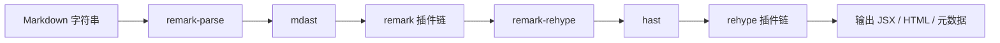
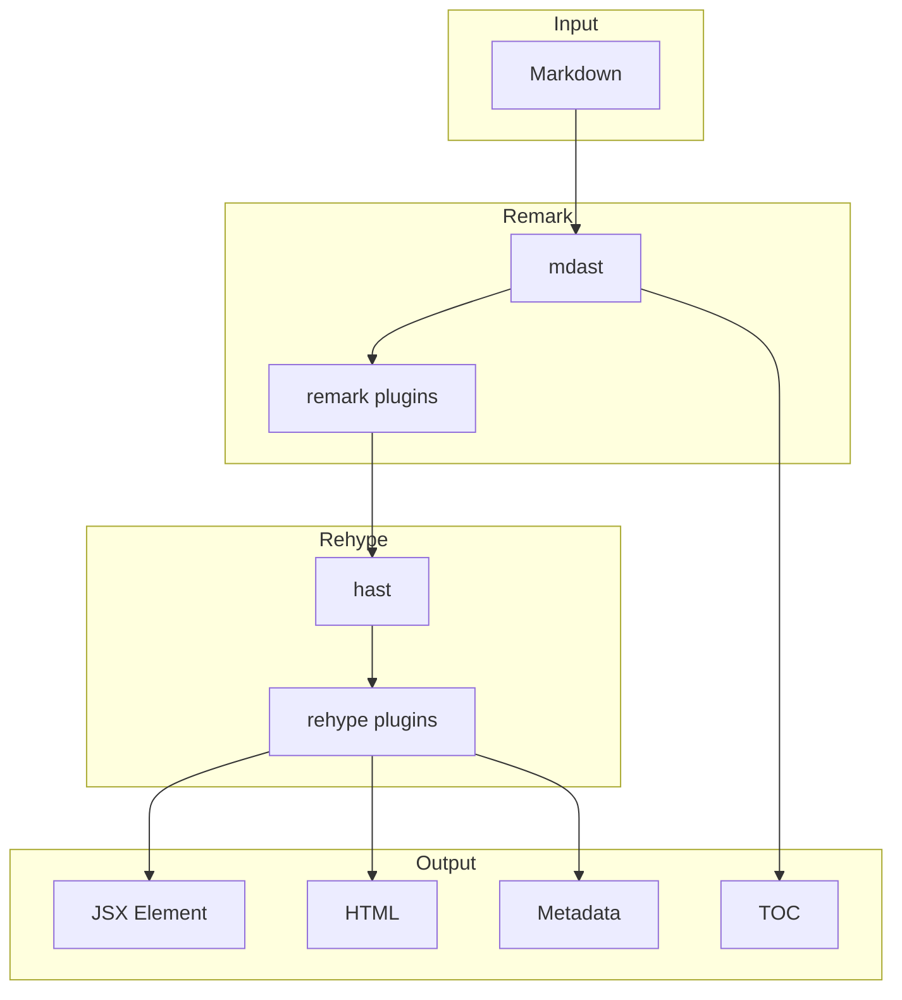

> 参考阅读：[如何优雅编译一个 Markdown 文档](https://diygod.cc/unified-markdown/)，本文结合该思路并落地到本项目的 unified 管线。

## 整体流程

统一思路可以理解为三步：**解析 → 转换 → 输出**。

- **解析（Parse）**：用 `remark-parse` 将 Markdown 解析为 `mdast`。
- **转换（Transform）**：在 `mdast` 与 `hast` 上串联 remark/rehype 插件做结构加工。
- **输出（Stringify）**：把 `hast` 输出为 JSX/HTML/元数据等目标格式。

## 关键概念

- **unified**：统一的语法树处理框架，负责驱动整个管线。
- **remark**：处理 Markdown 语法树（`mdast`）的生态。
- **rehype**：处理 HTML 语法树（`hast`）的生态。
- **mdast**：Markdown 的抽象语法树标准。
- **hast**：HTML 的抽象语法树标准。
- **vfile**：承载输入内容与元数据的文件对象。
- **unist-util-visit**：遍历语法树的工具，编写自定义插件的核心。

## 流程与架构图

下面是简化流程图：



以及统一管线的“层次结构”图：



在本项目里，核心流程在 `src/markdown/index.ts`，可简化为：

```ts
const processor = unified()
  .use(remarkParse)
  .use(remarkGithubAlerts)
  .use(remarkBreaks)
  .use(remarkFrontmatter, ['yaml'])
  .use(remarkGfm)
  .use(remarkDirective)
  .use(remarkCodeGroup)
  .use(remarkDirectiveRehype)
  .use(remarkMath, { singleDollarTextMath: false })
  .use(remarkPangu)
  .use(remarkEmoji)
  .use(remarkRehype, { allowDangerousHtml: true })
  .use(rehypeRaw)
  .use(rehypeCodeGroup)
  .use(rehypeSlug)
  .use(rehypeSanitize, strictMode ? undefined : sanitizeScheme)
  .use(rehypeMermaid)
  .use(rehypePeekabooLink)
  .use(rehypeFixBlock)
  .use(rehypeInferDescriptionMeta)
  .use(rehypeKatex, { strict: false });
```

## 项目中的 unified 管线

### Remark（处理 Markdown 阶段）

- `remark-parse`：Markdown → `mdast`。
- `remark-github-alerts`：支持 GitHub 风格的 Alert 块。
- `remark-breaks`：单换行也会成为换行（更贴近笔记写作习惯）。
- `remark-frontmatter`：读取 YAML frontmatter。
- `remark-gfm`：表格、任务列表、删除线等 GFM 语法。
- `remark-directive` + `remark-directive-rehype`：支持自定义指令语法（如 `:::code-group`）。
- `remark-code-group`（自定义）：将 `:::code-group` 转成 `<codegroup>`，并写入 `data-code-blocks`。
- `remark-math`：公式语法支持。
- `remark-pangu`（自定义）：处理中英文间距。
- `remark-emoji`：`:rocket:` → emoji。

### Rehype（处理 HTML/HAST 阶段）

- `rehype-raw`：允许 Markdown 内嵌 HTML（必须配合 sanitize）。
- `rehype-code-group`（自定义）：处理 `<CodeGroup>` HTML 语法并统一为 `<codegroup>`。
- `rehype-slug`：为标题生成 id。
- `rehype-sanitize`：安全过滤（并通过 `sanitize-schema.ts` 放行自定义标签/属性）。
- `rehype-mermaid`（自定义）：把 `language-mermaid` 的 code 转成 `<mermaid>` 组件。
- `rehype-peekaboo-link`（自定义）：外链变为自定义 `peekaboolink` 组件。
- `rehype-fix-block`（自定义）：把 `p > linkcard` 这类不合法结构包一层 `div.block-tag`，避免水合错误。
- `rehype-infer-description-meta`：自动生成文章描述。
- `rehype-katex`：渲染数学公式。

### 输出阶段（Stringify / Runtime）

- `hast-util-to-jsx-runtime`：输出 React Element（配合组件映射）。
- `hast-util-to-html`：生成 HTML 供 RSS 或缓存使用。
- `mdast-util-toc`：生成目录结构。
- `vfile`：统一承载上下文数据（frontmatter、meta 等）。

## 自定义 Unified 插件怎么写

插件本质是一个函数：**接收 tree → 访问节点 → 修改节点**。常用工具是 `unist-util-visit`。

下面是一个简化版的 rehype 插件：把外链 `<a>` 变成 `<peekaboolink>`：

```ts
import type { Root } from 'hast';
import type { Plugin } from 'unified';
import { visit } from 'unist-util-visit';

export const rehypePeekabooLink: Plugin<[], Root> = () => (tree) => {
  visit(tree, { type: 'element', tagName: 'a' }, (node, index, parent) => {
    const href = node.properties?.href;
    if (!href || typeof href !== 'string') return;
    if (href.startsWith('/') || href.startsWith('#')) return;

    if (parent && typeof index === 'number') {
      parent.children[index] = {
        type: 'element',
        tagName: 'peekaboolink',
        properties: { href },
        children: node.children,
      };
    }
  });
};
```

### 插件顺序原则

- `remark-*` 一定要放在 `remark-rehype` 前。
- `rehype-*` 一定要放在 `remark-rehype` 后。
- 若开启 `rehype-raw`，务必搭配 `rehype-sanitize`。
- 如果需要自定义标签，记得同步更新 `sanitize-schema.ts`。

## 组件映射与渲染策略

渲染阶段通过 `toJsxRuntime` + 组件映射完成：

```ts
toJsxRuntime(hastTree, {
  Fragment,
  components: createMdxComponents({ codeTheme }),
  ignoreInvalidStyle: true,
  jsx,
  jsxs,
  passNode: true,
});
```

因此统一建议：

- **自定义语义节点**（如 `mermaid`、`codegroup`）在 rehype 阶段生成。
- **自定义样式/交互** 在 MDX 组件映射里实现。
- **潜在的 HTML 嵌套错误** 在 rehype 阶段修复（如 `rehype-fix-block`）。

## 实战最佳实践清单

- **按职责拆分插件**：语法 → remark，结构 → rehype。
- **固定插件顺序**：尤其是 `remark-rehype` 与 `rehype-raw`。
- **启用 sanitize 白名单**：自定义组件一定写入 schema。
- **缓存 processor**：避免每次渲染都重新创建 pipeline。
- **插件保持纯函数**：只改 tree，不做副作用 IO。
- **数据读取统一走 VFile**：frontmatter、excerpt、meta 保持一致来源。
- **避免复杂正则**：用 AST 访问器更稳。

## 小结

Unified 的强大在于“**可组合的语法树处理**”。如果你只需要简单渲染，`markdown-to-jsx` 会更快上手；但当你需要**语法扩展、结构转换、安全清洗、元数据生成**时，Unified 体系更可控、更强大。

如果后续要扩展语法（如嵌入卡片、自动目录、媒体解析），只需要增加插件即可，不需要改渲染层逻辑。